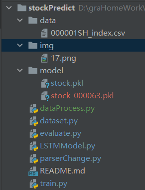

# stockPrediction
LSTM应用在股票预测中 Pytorch实现

# 软件环境
python3.0以上，
pytorch 1.3.1，
torchvision 0.4.1, 
Pillow 7.1.2,
pandas 1.0.3

# 项目结构

data目录：上证指数的csv文件 
model目录：模型保存文件 
dataset.py : 数据加载及预处理类，数据标准化、划分训练集及测试集等 
evaluate.py : 预测 
LSTMModel.py : 定义LSTM模型 
parsermy.py : 常用参数 
train.py：模型训练

# 运行方法：

        1.将修改dataProcess.py中的MySQL改为本机的MySQL地址
        2.将dataset.py中的MySQL改为本机的MySQL地址
        3.运行train.py开始模型训练
        4.直接运行evaluate.py开始模型预测
